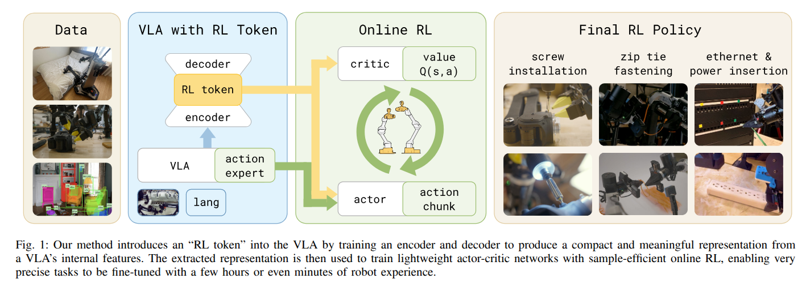

# RLT-UR5e: RL Token Online Learning

## Purpose
Implements the core RLT algorithm: compresses VLA embeddings into an RL Token, then trains a lightweight SAC actor-critic to refine VLA actions online.

## Architecture (from Paper)



```
┌─────────────────────────────────────────────────────────────────────────┐
│  Images + Language → [FROZEN VLA] → embeddings → [RL Token] → z_rl     │
│                           ↓                                    ↓       │
│                      ã_ref (10×6D)                        z_rl (512D)  │
│                           ↓                                    ↓       │
│       [SAC Actor: (z_rl, proprio, ã_ref) → residual a_{1:C}]          │
│       [SAC Critic: Q(state, action) → value]                          │
│                           ↓                                            │
│       final_action = ã_ref + clip(residual, ±3mm/±1.1°)               │
│                           ↓                                            │
│       [Robot executes 10 steps open-loop]                              │
│                           ↓                                            │
│       [Reward classifier: peg inserted? → +1]                         │
└─────────────────────────────────────────────────────────────────────────┘
```

## Code Structure
```
rlt/
├── agents/
│   ├── sac_agent.py           ← JAX SAC (TD3-style, 2 Q-functions)
│   └── rlt_buffer.py          ← Replay buffer for chunked transitions
├── models/
│   ├── rl_token.py            ← RL Token encoder-decoder (PyTorch)
│   ├── train_rl_token.py      ← Train RL Token from VLA embeddings
│   └── extract_embeddings.py  ← Extract embeddings from VLA checkpoint
├── envs/
│   └── ur5e_rlt_env.py        ← Gym env (SERL hardware + VLA + RL Token)
└── examples/
    └── peg_insertion/
        ├── config.py          ← RLTConfig dataclass (all hyperparams)
        └── train_rlt.py       ← Main training loop
```

## Hyperparameters (Paper-Matched)

| Parameter | Value | Source |
|-----------|-------|--------|
| Actor/Critic | 2-layer MLP [256, 256] | Paper Appendix |
| Critic ensemble | 2 Q-functions (TD3) | Paper Appendix |
| Chunk size C | 10 steps | Paper §3 |
| Ref action dropout | 50% training, 0% inference | Paper §3 |
| BC weight β | 1.0 | Config |
| Max residual | ±3mm position, ±1.1° rotation | Safety |
| Discount γ | 0.97 | Config |
| UTD ratio | 5 | Config |
| Warmup episodes | 20 (VLA-only) | Config |
| Reward | Sparse binary (classifier) | Paper §3 |

## Observation Space (SAC sees NO images)
```
obs = [z_rl(512) | proprio(19) | ã_ref_flat(60)] = 591 dimensions

where:
  z_rl:     RL Token output (compressed VLA state)
  proprio:  tcp_pose(6) + tcp_vel(6) + force(3) + torque(3) + gripper(1)
  ã_ref:    VLA reference chunk (10 steps × 6D, flattened)
```

## Training Flow
1. **Warmup:** Run VLA-only for 20 episodes → fill buffer
2. **Online RL:** Each episode:
   - Get VLA embeddings → RL Token → z_rl
   - SAC predicts residual correction
   - Execute: final = VLA + residual
   - Get reward from classifier
   - Train SAC (UTD=5 gradient steps per env step)

## Key Commands

```bash
cd /home/robolab-2/ur5e_hande_workspace/rlt_ur5e
source ur5e_hil_serl/.venv/bin/activate
export PYTHONPATH="$PWD:$PWD/ur5e_hil_serl:$PWD/ur5e_hil_serl/serl_robot_infra:$PWD/ur5e_hil_serl/examples:$PYTHONPATH"
export JAX_PLATFORMS=cpu

# Test (fake env, no hardware)
python -m rlt.examples.peg_insertion.train_rlt --fake_env

# Real training (VLA server must be running)
python -m rlt.examples.peg_insertion.train_rlt

# Evaluate
python -m rlt.examples.peg_insertion.train_rlt --eval_only --eval_episodes 20
```

## Checkpoints
- **RL Token:** `checkpoints/rl_token/peg_insertion_real_v1.pt`
- **SAC Agent:** `checkpoints/rlt_runs/peg_insertion/best.pkl`
- Both needed for RLT inference (VLA server + SAC + RL Token)
