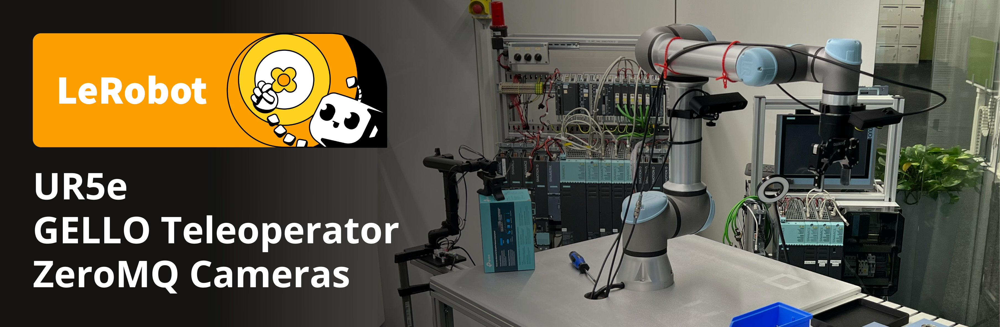

# LeRobot UR5e + GELLO — Robot Control & Data Collection



A complete [LeRobot](https://github.com/huggingface/lerobot) integration for the **UR5e** robot arm with **dual cameras** and **keyboard/GELLO teleoperation**. Record demonstration datasets, then deploy fine-tuned π0/π0-FAST policies for real-world manipulation.

---

## 🎯 What This Does

| Capability | Description |
|-----------|-------------|
| **Record Demos** | Teleoperate UR5e via keyboard (or GELLO), record state + actions + images |
| **Dual Camera** | RealSense D435 (wrist) + Kinect v2 (overhead) — both captured at 30fps |
| **Policy Inference** | Connect to OpenPI server, stream observations, execute action chunks at 30Hz |
| **LeRobot Compatible** | Uses LeRobot's plugin system — datasets work with HuggingFace Hub |

---

## 🔧 Hardware Requirements

| Component | Model | Connection |
|-----------|-------|------------|
| Robot Arm | Universal Robots UR5e | Ethernet (172.22.1.139) |
| Gripper | Robotiq Hand-E | Tool I/O (on UR5e) |
| Wrist Camera | Intel RealSense D435 (serial: 034422070605) | USB 3.0 |
| Overhead Camera | Azure Kinect v2 / Xbox Kinect (serial: 000631452147) | USB 3.0 |
| Teleoperator | Keyboard (built-in) or [GELLO](https://wuphilipp.github.io/gello_site/) | USB |
| GPU Server | Any NVIDIA GPU ≥16GB (for serving π0 policy) | Network/localhost |

### Hardware Diagram

```
┌──────────────────────────────────────────────────────┐
│                  WORKSTATION                          │
│  ┌─────────────┐  ┌─────────────┐  ┌─────────────┐  │
│  │  Keyboard   │  │  RealSense  │  │  Kinect v2  │  │
│  │  (teleop)   │  │  D435 USB   │  │  USB 3.0    │  │
│  └──────┬──────┘  └──────┬──────┘  └──────┬──────┘  │
│         │                │                │          │
│  ┌──────▼─��──────────────▼────────────────▼──────┐   │
│  │           Python Control Loop                 │   │
│  │  record.py / remote_pi_inference_dual_cam.py  │   │
│  └──────────────────────┬────────────────────────┘   │
│                         │ Ethernet (RTDE)            │
└─────────────────────────┼────────────────────────────┘
                          │
              ┌───────────▼───────────┐
              │       UR5e Robot      │
              │   172.22.1.139:30004  │
              │   + Robotiq Hand-E    │
              └───────────────────────┘
```

---

## 📦 Installation (From Scratch)

### Prerequisites

```bash
# Ubuntu 22.04+
sudo apt update
sudo apt install -y python3.11 python3.11-venv libusb-1.0-0-dev libudev-dev \
  libk4a1.4 libk4a1.4-dev k4a-tools  # For Kinect v2

# Install uv (Python package manager)
curl -LsSf https://astral.sh/uv/install.sh | sh
source ~/.bashrc

# RealSense SDK (for Intel D435)
sudo apt install -y librealsense2-dkms librealsense2-utils librealsense2-dev
```

### Setup

```bash
# Clone the repository
git clone git@github.com:saifi-shahrukh/openpi_ur5e-.git
cd openpi_ur5e-/lerobot_ur5e_gello

# Create virtual environment and install all dependencies
uv sync

# Verify installation
source .venv/bin/activate
python -c "import lerobot; print('LeRobot version:', lerobot.__version__)"
```

### Verify Hardware

```bash
source .venv/bin/activate

# Test cameras
python scripts/unit_test_cameras.py

# Test robot connectivity
ping 172.22.1.139

# Test RealSense
realsense-viewer  # Should show D435 feed

# Test Kinect
k4aviewer  # Should show Kinect feed
```

---

## 🎮 Recording Demonstrations

### Quick Start — Keyboard Teleoperation (Recommended for New Users)

```bash
cd lerobot_ur5e_gello && source .venv/bin/activate

python scripts/record.py \
  --robot.type=ur5e_dual_cam \
  --robot.ip=172.22.1.139 \
  --teleop.type=keyboard_ur5e \
  --dataset.repo-id=saifi/ur5e-peg-insertion-dual \
  --dataset.single-task="Pick up the peg and insert it into the hole." \
  --dataset.num-episodes=30 \
  --dataset.fps=30 \
  --dataset.push-to-hub=False
```

### Controls During Recording

| Key | Action |
|-----|--------|
| **SPACE** | Start recording current episode |
| **S** | Stop & save current episode |
| **ESC** | Discard current episode / exit |
| **G** | Toggle gripper open/close |
| **Arrow Keys** | Move robot in XY plane |
| **Page Up/Down** | Move robot up/down (Z axis) |
| **Home/End** | Rotate wrist |

### Workflow

1. Script starts → robot connects → cameras initialize
2. **Move robot to starting position** using keyboard
3. Press **SPACE** to START recording
4. Perform the task (teleoperate the robot)
5. Press **S** to STOP and save the episode
6. Repeat from step 2 for next episode

### Recording Tips for Good Training Data

- **30+ demos minimum** for a simple task
- **Vary start positions** — don't always start from same spot
- **Vary approach angles** — reach object from different directions
- **Keep demos SHORT** — 5-10 seconds each (150-300 frames at 30fps)
- **Be SMOOTH** — no jerky movements
- **Consistent task completion** — always finish the full task

### Alternative: GELLO Teleoperation

```bash
# First calibrate GELLO
python scripts/calibrate_gello_teleop.py --port /dev/ttyUSB0 --id gello_teleop

# Record with GELLO
python scripts/record.py \
  --robot.type=ur5e_dual_cam \
  --robot.ip=172.22.1.139 \
  --teleop.type=gello \
  --teleop.port=/dev/ttyUSB0 \
  --teleop.id=gello_teleop \
  --dataset.repo-id=saifi/ur5e-peg-insertion-dual \
  --dataset.single-task="Pick up the peg and insert it into the hole." \
  --dataset.num-episodes=30 \
  --dataset.fps=30 \
  --dataset.push-to-hub=False
```

---

## 🤖 Running Policy Inference

### Prerequisites

1. A trained model served via OpenPI (see [openpi-ur5e README](../openpi-ur5e/README.md))
2. Server running on `localhost:8000` (or remote GPU machine)

### Dual Camera Inference (Recommended)

```bash
cd lerobot_ur5e_gello && source .venv/bin/activate

python scripts/remote_pi_inference_dual_cam.py \
  --ip=localhost \
  --port=8000 \
  --prompt="Pick up the peg and insert it into the hole." \
  --robot.type=ur5e_dual_cam \
  --robot.ip=172.22.1.139 \
  --fps=30
```

### Single Camera Inference (Wrist Only)

```bash
python scripts/remote_pi_inference_single_cam.py \
  --ip=localhost \
  --port=8000 \
  --prompt="Pick up the peg and insert it into the hole." \
  --robot.type=ur5e \
  --robot.ip=172.22.1.139 \
  --fps=30
```

### What Happens During Inference

```
Loop at 30Hz:
  1. Read joint state (6 joints + gripper)
  2. Capture wrist image (640×480 RGB)
  3. Capture overhead image (640×480 RGB)
  4. Send to policy server via WebSocket
  5. Receive action chunk (30 future actions)
  6. Execute actions one-by-one at 30Hz
  7. Request new chunk when current one expires
```

> ⚠️ **SAFETY:** Always keep hand on E-STOP! Press ESC to stop inference.

---

## 📁 Repository Structure

```
lerobot_ur5e_gello/
├── scripts/
│   ├── record.py                        # Record demos (keyboard or GELLO)
│   ├── remote_pi_inference_dual_cam.py  # Deploy π0 policy (2 cameras)
│   ├── remote_pi_inference_single_cam.py# Deploy π0 policy (1 camera)
│   ├── remote_pi_inference.py           # Generic inference script
│   ├── teleoperate.py                   # Manual teleoperation (no recording)
│   ├── calibrate_gello_teleop.py        # Calibrate GELLO device
│   ├── kinect_zmq_server.py             # Stream Kinect over ZMQ (remote)
│   ├── eval.py                          # Evaluation script
│   └── unit_test_cameras.py             # Test camera connections
│
├── lerobot_robot_ur5e/                  # UR5e robot driver plugin
│   └── lerobot_robot_ur5e/
│       ├── config_ur5e.py               # Robot configs (single/dual cam)
│       ├── ur5e.py                      # RTDE control + gripper driver
│       └── robotiq_gripper.py           # Robotiq Hand-E gripper driver
│
├── lerobot_camera_kinect/               # Kinect v2 camera plugin
│   └── lerobot_camera_kinect/
│       ├── config_kinect.py             # Kinect config
│       └── kinect_camera.py             # pyk4a-based driver
│
├── lerobot_camera_zmq/                  # ZMQ remote camera plugin
│   └── lerobot_camera_zmq/
│       ├── config_zmq_camera.py         # ZMQ camera config
│       └── zmq_camera.py               # Network camera streaming
│
├── lerobot_teleoperator_keyboard_ur5e/  # Keyboard teleoperation plugin
│   └── lerobot_teleoperator_keyboard_ur5e/
│       ├── config_keyboard_ur5e.py      # Keyboard config
│       ├── keyboard_ur5e.py             # Arrow key → Cartesian control
│       └── ur5e_kin.py                  # UR5e forward kinematics
│
├── lerobot_teleoperator_gello/          # GELLO teleoperation plugin
│   └── lerobot_teleoperator_gello/
│       ├── config_gello.py              # GELLO config
│       └── gello.py                     # Dynamixel-based control
│
├── openpi_client/                       # OpenPI WebSocket client
│   ├── websocket_client_policy.py       # Connect to policy server
│   ├── base_policy.py                   # Policy interface
│   └── msgpack_numpy.py                 # Efficient serialization
│
├── pi_streamer/                         # Raspberry Pi camera streaming
│   ├── streamer.py                      # Camera → ZMQ publisher
│   └── config.json                      # Stream configuration
│
├── pyproject.toml                       # Project dependencies
├── uv.lock                              # Locked dependency versions
└── .gitignore
```

---

## 🔧 Configuration

### Robot Types

| Type | Cameras | Config Class |
|------|---------|-------------|
| `ur5e` | RealSense D435 wrist only | `UR5EConfig` |
| `ur5e_dual_cam` | RealSense D435 + Kinect v2 | `UR5EDualCamConfig` |

### Teleoperator Types

| Type | Device | Config Class |
|------|--------|-------------|
| `keyboard_ur5e` | Computer keyboard | `KeyboardUR5eConfig` |
| `gello` | GELLO haptic arm | `GelloConfig` |

### Modifying Camera Serials

Edit `lerobot_robot_ur5e/lerobot_robot_ur5e/config_ur5e.py`:

```python
# Wrist camera
"wrist_cam": RealSenseCameraConfig(
    serial_number_or_name="YOUR_REALSENSE_SERIAL",  # Find via: realsense-viewer
    ...
)

# Overhead camera
"overview_cam": KinectCameraConfig(
    serial="YOUR_KINECT_SERIAL",  # Find via: k4aviewer
    ...
)
```

### Modifying Robot IP

Pass `--robot.ip=YOUR_ROBOT_IP` to any script, or edit the default in `config_ur5e.py`.

---

## 🐛 Troubleshooting

| Problem | Solution |
|---------|----------|
| `RTDE input registers already in use` | Kill zombie processes: `pkill -f rtde` or restart robot |
| `RealSense not found` | Replug USB, check: `rs-enumerate-devices` |
| `Kinect not detected` | Check USB 3.0 port, run: `k4aviewer` |
| `Connection refused (port 8000)` | Start policy server first in another terminal |
| `Protective stop` | Clear on teach pendant → ensure Remote Control mode |
| `No module named lerobot` | Run `source .venv/bin/activate` first |
| Robot moves to wrong position | Check robot is in Remote Control mode (not Local) |
| Slow inference (first call ~13s) | Normal — JAX JIT compilation. Subsequent calls: ~1.5s |

### Common Fixes

```bash
# Kill zombie robot connections
pkill -f remote_pi_inference
pkill -f rtde

# Check GPU processes (if serving locally)
nvidia-smi

# Reset robot: on teach pendant
# 1. Clear Protective Stop
# 2. Set to Remote Control mode
# 3. Power cycle if needed
```

---

## 📚 Full Pipeline (End-to-End)

```bash
# ═══════ STEP 1: Record demos ═══════
cd lerobot_ur5e_gello && source .venv/bin/activate
python scripts/record.py \
  --robot.type=ur5e_dual_cam --robot.ip=172.22.1.139 \
  --teleop.type=keyboard_ur5e \
  --dataset.repo-id=saifi/ur5e-peg-insertion-dual \
  --dataset.single-task="Pick up the peg and insert it into the hole." \
  --dataset.num-episodes=30 --dataset.fps=30 --dataset.push-to-hub=False

# ═══════ STEP 2: Train (in openpi-ur5e) ═══════
cd ../openpi-ur5e && source .venv/bin/activate
uv run scripts/compute_norm_stats.py --config-name=pi0_fast_ur5e_peg_insertion_lora
./scripts/train_local.sh pi0_fast_ur5e_peg_insertion_lora --exp-name=peg_v2 --overwrite

# ═══════ STEP 3: Serve model ═══════
uv run scripts/serve_policy.py policy:checkpoint \
  --policy.config=pi0_fast_ur5e_peg_insertion_lora \
  --policy.dir=./checkpoints/pi0_fast_ur5e_peg_insertion_lora/peg_v2/29999

# ═══════ STEP 4: Run on robot (new terminal) ═══════
cd ../lerobot_ur5e_gello && source .venv/bin/activate
python scripts/remote_pi_inference_dual_cam.py \
  --ip=localhost --port=8000 \
  --prompt="Pick up the peg and insert it into the hole." \
  --robot.type=ur5e_dual_cam --robot.ip=172.22.1.139 --fps=30
```

---

## 📖 References

1. **LeRobot:** [Cadene et al., Hugging Face LeRobot — Open-source robotics framework](https://github.com/huggingface/lerobot)
2. **OpenPI (π0):** [Physical Intelligence — Open-source π0 implementation](https://github.com/Physical-Intelligence/openpi)
3. **GELLO:** [Wu et al., "GELLO: A General, Low-Cost, and Intuitive Teleoperation Framework for Robot Manipulators", 2023](https://wuphilipp.github.io/gello_site/)
4. **UR RTDE:** [SDU Robotics — Universal Robots RTDE Interface](https://sdurobotics.gitlab.io/ur_rtde/)
5. **Intel RealSense:** [Intel RealSense SDK 2.0](https://github.com/IntelRealSense/librealsense)
6. **Azure Kinect:** [Microsoft Azure Kinect SDK](https://github.com/microsoft/Azure-Kinect-Sensor-SDK)
7. **Robotiq Hand-E:** [Robotiq Adaptive Grippers](https://robotiq.com/products/adaptive-grippers)

---

## 📄 License

Apache License 2.0 — See [LICENSE](LICENSE) for details.

---

**Maintainer:** Shahrukh Saifi (shahrukh.saifi20@gmail.com)
